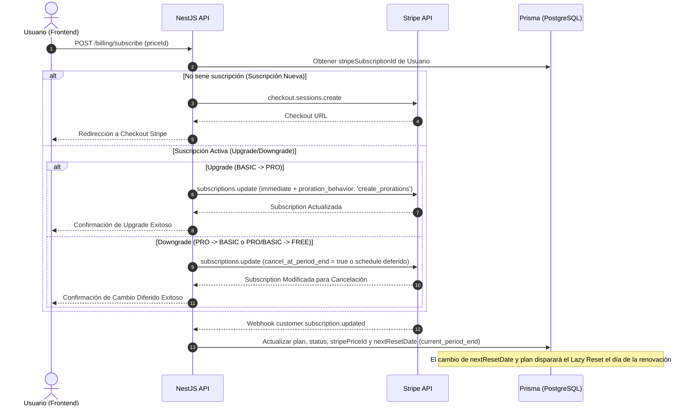

# Plan de Implementación: Gestión de Suscripciones y Ciclo de Vida con Stripe (Upgrades & Downgrades)

Este plan describe de manera profesional y estructurada el flujo de cambio de plan (Upgrades con prorrateo inmediato y Downgrades diferidos al final del periodo) integrando NestJS, Stripe API, Prisma ORM y React.

---

## 🎯 Arquitectura Propuesta



---

## 1. Capa del Servidor (NestJS Endpoints & API de Stripe)

El servidor debe administrar de manera inteligente si se trata de una suscripción nueva, un **Upgrade** (cargo prorrateado inmediato) o un **Downgrade** (reprogramación diferida).

### Flujo de Negocio y Ciclo de Reinicio
*   **Upgrade**: Se cobra de inmediato la diferencia prorrateada y el plan cambia a uno mayor en la base de datos de manera inmediata. **Los contadores de conciliación y RFCs mensuales se mantienen intactos** hasta finalizar el ciclo actual. Esto es justo, ya que el usuario recibe mayores límites inmediatos, pero conserva su consumo actual sin "regalarle" un reinicio doble (evita abusos de hacer reset a mitad de mes).
*   **Downgrade**: Se configura `cancel_at_period_end = true` en Stripe (o se programa una rebaja en Stripe Subscription Schedules). El usuario mantiene el estatus de plan alto y todos sus beneficios hasta el día de corte (`currentPeriodEnd` en la base de datos). Al llegar dicho día, el webhook procesará el downgrade y al consultar el perfil se disparará el Lazy Reset natural.

#### [NEW] [billing-subscription.service.ts](file:///c:/React/ConciliaFacil/backend/src/billing/billing-subscription.service.ts)

```typescript
import { Injectable, BadRequestException, NotFoundException } from '@nestjs/common';
import { PrismaService } from '../prisma/prisma.service';
import { UserPlan } from '@prisma/client';
import Stripe from 'stripe';

const PLAN_HIERARCHY: Record<UserPlan, number> = {
  FREE: 0,
  BASIC: 1,
  PRO: 2,
};

const PRICE_TO_PLAN: Record<string, UserPlan> = {
  'price_1TpCWFRk8JjGytDbEsAY9wVo': UserPlan.BASIC,
  'price_1TqgASRk8JjGytDb5oegIhB0': UserPlan.PRO,
};

@Injectable()
export class BillingSubscriptionService {
  private stripe: Stripe;

  constructor(private readonly prisma: PrismaService) {
    this.stripe = new Stripe(process.env.STRIPE_SECRET_KEY!, {
      apiVersion: '2026-06-24.dahlia',
    });
  }

  async processPlanChange(userId: string, targetPriceId: string | null) {
    const user = await this.prisma.user.findUnique({
      where: { id: userId },
    });

    if (!user) {
      throw new NotFoundException('Usuario no encontrado.');
    }

    const currentPlan = user.plan;
    const targetPlan = targetPriceId ? (PRICE_TO_PLAN[targetPriceId] || UserPlan.FREE) : UserPlan.FREE;

    // Si el usuario no tiene suscripción activa o quiere volver a FREE directamente
    if (!user.stripeSubscriptionId) {
      if (targetPlan === UserPlan.FREE) {
        throw new BadRequestException('Ya te encuentras en el Plan Gratis.');
      }
      // Redirigir a creación de checkout normal
      return { action: 'REDIRECT_CHECKOUT', targetPriceId };
    }

    const currentHierarchy = PLAN_HIERARCHY[currentPlan];
    const targetHierarchy = PLAN_HIERARCHY[targetPlan];

    if (currentHierarchy === targetHierarchy) {
      throw new BadRequestException('Estás intentando seleccionar tu mismo plan actual.');
    }

    const subscription = await this.stripe.subscriptions.retrieve(user.stripeSubscriptionId);

    // ==========================================
    // CASO A: UPGRADE (Inmediato con Prorrateo)
    // ==========================================
    if (targetHierarchy > currentHierarchy) {
      const subscriptionItemId = subscription.items.data[0].id;

      const updatedSubscription = await this.stripe.subscriptions.update(
        user.stripeSubscriptionId,
        {
          proration_behavior: 'create_prorations',
          items: [
            {
              id: subscriptionItemId,
              price: targetPriceId!,
            },
          ],
        },
      );

      // Actualizamos base de datos inmediatamente
      await this.prisma.user.update({
        where: { id: userId },
        data: {
          plan: targetPlan,
          stripePriceId: targetPriceId,
          subscriptionStatus: updatedSubscription.status,
        },
      });

      return {
        action: 'UPGRADE_SUCCESS',
        message: 'Plan actualizado con éxito de forma inmediata. Se cobró el prorrateo respectivo.',
      };
    }

    // ==========================================
    // CASO B: DOWNGRADE (Diferido al final de ciclo)
    // ==========================================
    if (targetHierarchy < currentHierarchy) {
      if (targetPlan === UserPlan.FREE) {
        // Cancelación al final del periodo (baja a FREE)
        await this.stripe.subscriptions.update(user.stripeSubscriptionId, {
          cancel_at_period_end: true,
        });

        return {
          action: 'DOWNGRADE_PENDING',
          message: 'Tu suscripción será cancelada al finalizar el ciclo de cobro. Mantendrás beneficios hasta entonces.',
        };
      } else {
        // Degradación a un plan de cobro menor (BASIC de Stripe) diferido
        // Usamos Subscription Schedules para programar el cambio seguro al final del periodo
        const schedule = await this.stripe.subscriptionSchedules.create({
          from_subscription: user.stripeSubscriptionId,
        });

        const currentPhase = schedule.phases[0];

        await this.stripe.subscriptionSchedules.update(schedule.id, {
          phases: [
            {
              start_date: currentPhase.start_date,
              end_date: currentPhase.end_date,
              items: currentPhase.items,
            },
            {
              start_date: currentPhase.end_date,
              items: [
                {
                  price: targetPriceId!,
                  quantity: 1,
                },
              ],
            },
          ],
        });

        return {
          action: 'DOWNGRADE_PENDING',
          message: 'Tu plan se actualizará al plan Básico de forma automática el día de tu próxima fecha de cobro.',
        };
      }
    }
  }
}
```

#### [MODIFY] [billing.controller.ts](file:///c:/React/ConciliaFacil/backend/src/billing/billing.controller.ts)

Añadir el endpoint para procesar el cambio de plan:

```typescript
// ... imports ...
import { BillingSubscriptionService } from './billing-subscription.service';

@Controller('billing')
export class BillingController {
    constructor(
        private readonly billingService: BillingService,
        private readonly billingSubscriptionService: BillingSubscriptionService, // ← Inyección
    ) { }

    // ... create-checkout-session ...

    @Post('change-plan')
    @UseGuards(SupabaseAuthGuard)
    async changePlan(
        @Body('priceId') priceId: string | null,
        @Req() req: any
    ) {
        const userId = req.user?.id;
        return this.billingSubscriptionService.processPlanChange(userId, priceId);
    }

    // ... webhook ...
}
```

---

## 2. Capa del Webhook (Sincronización Asíncrona con Prisma)

El webhook es responsable de mantener la BD sincronizada cuando ocurren los cambios (tanto de cobros exitosos como renovaciones, upgrades inmediatos o degradaciones diferidas).

El evento principal para cambios en suscripción es `customer.subscription.updated` y `customer.subscription.deleted`. 

#### [MODIFY] [billing.service.ts](file:///c:/React/ConciliaFacil/backend/src/billing/billing.service.ts)

Soporte completo para actualizar el plan del usuario, mapear `nextResetDate` directamente a `current_period_end` de Stripe y manejar la degradación cuando expira la suscripción (`customer.subscription.deleted`).

```typescript
            case 'customer.subscription.updated': {
                const subscription = event.data.object as Stripe.Subscription;
                const stripeCustomerId = subscription.customer as string;
                
                const periodEnd = subscription.items.data[0]?.current_period_end || subscription.current_period_end;
                const purchasedPriceId = subscription.items.data[0]?.price.id;

                const planConfig = PLAN_CONFIG[purchasedPriceId] ?? { plan: UserPlan.FREE };

                // Si está programada para cancelarse al final y ya expiró/cambió, Stripe enviará los eventos correctos.
                // Mapear nextResetDate directamente al término del periodo de Stripe.
                // Esto gatillará automáticamente el Lazy Reset en la siguiente consulta al perfil.
                await this.prisma.user.updateMany({
                    where: { stripeCustomerId },
                    data: {
                        stripePriceId: purchasedPriceId,
                        subscriptionStatus: subscription.status,
                        currentPeriodEnd: new Date(periodEnd * 1000),
                        nextResetDate: new Date(periodEnd * 1000), // Sincronización del reset local con Stripe
                        plan: planConfig.plan,
                        isSubscribed: subscription.status === 'active',
                    },
                });
                break;
            }

            case 'customer.subscription.deleted': {
                const subscription = event.data.object as Stripe.Subscription;
                const stripeCustomerId = subscription.customer as string;

                // El usuario vuelve a plan gratuito
                await this.prisma.user.updateMany({
                    where: { stripeCustomerId },
                    data: {
                        plan: UserPlan.FREE,
                        stripePriceId: null,
                        stripeSubscriptionId: null,
                        subscriptionStatus: 'canceled',
                        isSubscribed: false,
                        // Se deja nextResetDate tal cual para que el Lazy Reset limpie los contadores
                    },
                });
                break;
            }
```

---

## 3. Capa del Cliente (Frontend - React + Tailwind)

### Lógica de Estados en la Tarjeta de Precios

*   **✓ Plan actual**: Deshabilitado (es el plan del usuario).
*   **Upgrade**: Botón destacado de color sólido. Al dar clic abre un modal de confirmación informando del prorrateo inmediato.
*   **Downgrade**: Botón de tipo outline. Al dar clic abre un modal informando que los privilegios expiran al final del ciclo.

#### [NEW] [billingApi.ts](file:///c:/React/ConciliaFacil/frontend/src/features/billing/api/billingApi.ts)

```typescript
import axios from 'axios';

const api = axios.create({
  baseURL: import.meta.env.VITE_API_URL || 'http://localhost:3000',
});

// Suponiendo que usas Supabase JWT en cabeceras
export async function changePlanRequest(priceId: string | null, token: string) {
  const { data } = await api.post(
    '/billing/change-plan',
    { priceId },
    {
      headers: {
        Authorization: `Bearer ${token}`,
      },
    },
  );
  return data;
}
```

#### [MODIFY] [PricingPage.tsx](file:///c:/React/ConciliaFacil/frontend/src/features/billing/pages/PricingPage.tsx)

Implementación de la lógica de negocio en el frontend con modales de confirmación dinámicos de Tailwind:

```tsx
import React, { useState, useMemo } from "react";
// ... imports ...
import { changePlanRequest } from "../api/billingApi";
import { toast } from "sonner";

export const PricingPage: React.FC = () => {
  const { data: profile, refetch: refetchProfile } = useGetProfile();
  const [selectedPlan, setSelectedPlan] = useState<SubscriptionPlan | null>(null);
  const [isConfirmOpen, setIsConfirmOpen] = useState(false);
  const [isProcessing, setIsProcessing] = useState(false);

  const currentPlan = profile?.plan || "FREE";

  const getPlanActionType = (planId: string): "UPGRADE" | "DOWNGRADE" | "CHECKOUT" | "CURRENT" => {
    const PLAN_RANK: Record<string, number> = { FREE: 0, BASIC: 1, PRO: 2 };
    const currentRank = PLAN_RANK[currentPlan];
    const targetRank = PLAN_RANK[planId.toUpperCase()];

    if (currentRank === targetRank) return "CURRENT";
    if (currentPlan === "FREE") return "CHECKOUT"; // Nueva compra redirige a pasarela
    return targetRank > currentRank ? "UPGRADE" : "DOWNGRADE";
  };

  const handleCheckoutClick = (plan: SubscriptionPlan) => {
    const actionType = getPlanActionType(plan.id);

    if (actionType === "CURRENT") return;
    
    setSelectedPlan(plan);
    setIsConfirmOpen(true);
  };

  const confirmChange = async () => {
    if (!selectedPlan) return;
    setIsProcessing(true);
    try {
      // Obtener sesión/token (Supabase)
      const sessionStr = localStorage.getItem("sb-auth-token"); // O tu store de auth
      const token = sessionStr ? JSON.parse(sessionStr)?.access_token : "";

      const response = await changePlanRequest(selectedPlan.stripePriceId, token);

      if (response.action === "REDIRECT_CHECKOUT") {
        // Redirige a Stripe Checkout (utilizando tu store de checkout existente si aplica)
        window.location.href = response.url;
      } else {
        toast.success(response.message);
        refetchProfile();
      }
    } catch (err: any) {
      toast.error(err.response?.data?.message || "Ocurrió un error al procesar la solicitud.");
    } finally {
      setIsProcessing(false);
      setIsConfirmOpen(false);
      setSelectedPlan(null);
    }
  };

  return (
    <div>
      {/* ... Renderizado de Pricing Cards ... */}
      
      {/* Modal de Confirmación de Cambios de Suscripción */}
      {isConfirmOpen && selectedPlan && (
        <div className="fixed inset-0 bg-black/60 backdrop-blur-xs flex items-center justify-center p-4 z-50 animate-fade-in">
          <div className="bg-white dark:bg-slate-900 rounded-2xl p-6 max-w-md w-full shadow-2xl border border-slate-100 dark:border-slate-800 space-y-6">
            <h3 className="text-lg font-bold text-slate-900 dark:text-slate-100">
              Confirmar cambio a {selectedPlan.name}
            </h3>

            <p className="text-sm text-slate-600 dark:text-slate-405 leading-relaxed">
              {getPlanActionType(selectedPlan.id) === "UPGRADE" ? (
                <>
                  Estás solicitando una <strong>mejora inmediata de plan</strong>. Stripe calculará la cuota
                  prorrateada por los días restantes de tu mes de facturación actual y recibirás acceso a los nuevos
                  límites inmediatamente.
                </>
              ) : (
                <>
                  Estás solicitando una <strong>degradación de plan</strong>. Conservarás todos los beneficios de tu
                  plan actual <strong>{currentPlan}</strong> hasta tu próxima fecha de renovación el{" "}
                  <strong>{new Date(profile?.nextResetDate ?? "").toLocaleDateString()}</strong>. A partir de ese momento,
                  los contadores volverán a 0 bajo el nuevo límite.
                </>
              )}
            </p>

            <div className="flex justify-end gap-3">
              <button
                onClick={() => setIsConfirmOpen(false)}
                disabled={isProcessing}
                className="py-2.5 px-4 bg-slate-100 hover:bg-slate-200 dark:bg-slate-800 dark:hover:bg-slate-700 text-slate-700 dark:text-slate-200 text-xs font-semibold rounded-xl transition"
              >
                Cancelar
              </button>
              <button
                onClick={confirmChange}
                disabled={isProcessing}
                className={`py-2.5 px-5 text-white text-xs font-semibold rounded-xl shadow-md transition flex items-center gap-2 ${
                  getPlanActionType(selectedPlan.id) === "UPGRADE"
                    ? "bg-indigo-600 hover:bg-indigo-700"
                    : "bg-amber-600 hover:bg-amber-700"
                }`}
              >
                {isProcessing ? (
                  <>
                    <svg className="animate-spin h-4 w-4 text-white" fill="none" viewBox="0 0 24 24">
                      <circle className="opacity-25" cx="12" cy="12" r="10" stroke="currentColor" strokeWidth="4" />
                      <path className="opacity-75" fill="currentColor" d="M4 12a8 8 0 018-8V0C5.373 0 0 5.373 0 12h4z" />
                    </svg>
                    <span>Procesando...</span>
                  </>
                ) : (
                  "Confirmar Cambio"
                )}
              </button>
            </div>
          </div>
        </div>
      )}
    </div>
  );
};
```

---

## Plan de Verificación

- [ ] **Test de Upgrade (Caja de arena/Stripe CLI)**: Simular un upgrade inmediato y verificar que el plan del usuario se actualice al instante con el status de Stripe en Prisma.
- [ ] **Test de Downgrade Diferido**: Simular un downgrade y comprobar que la base de datos mantenga el estatus premium, y que la fecha de reinicio del usuario esté sincronizada exactamente con Stripe.
- [ ] **Test de Expiración**: Forzar el disparo del evento `customer.subscription.deleted` mediante la CLI de Stripe y asegurar que el usuario retorne al plan `FREE` y sus límites se reajusten en el frontend en el siguiente Lazy Reset.
